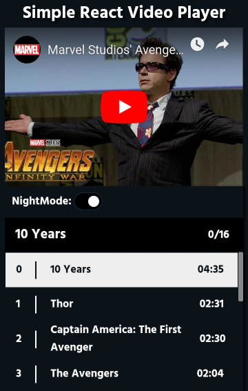
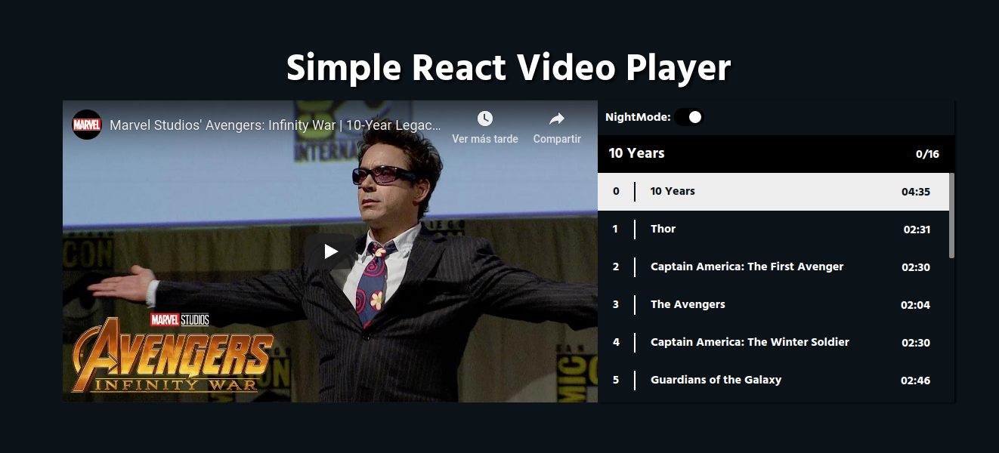

# ReactVideoPlayer

This is a simple resposive player made with ReactJS in a [Udemy course](https://www.udemy.com/react-hooks-videoplayer/).

## What I Learned

  - Create higher order components (HOC).
  - Hooks
  - Use Styled Components
  - Deploy React App in Github Pages

## Screenshots

<h1 align="center">
  
  
</h1>
<h1 align="center">
  
</h1>

